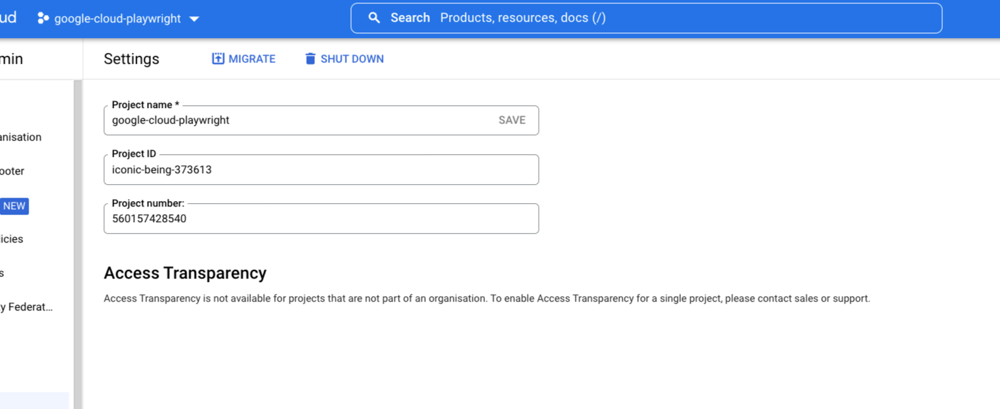
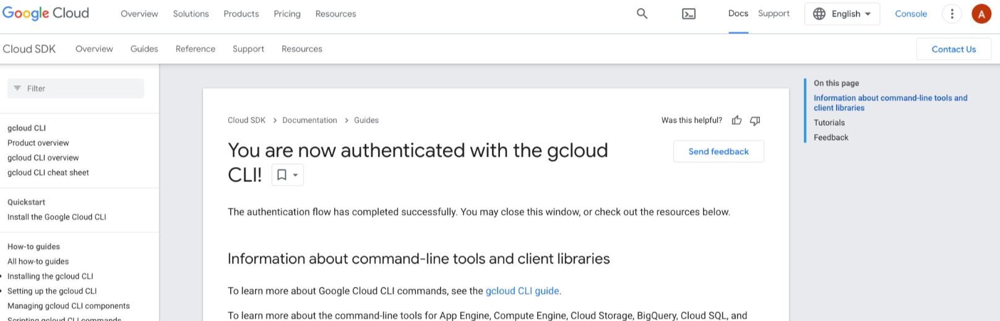
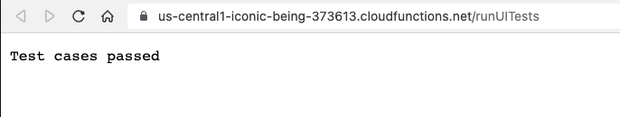
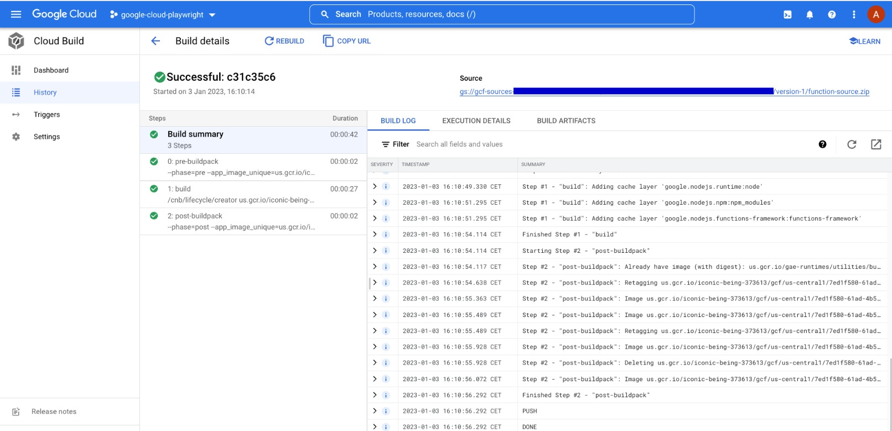

# Google Cloud, Playwright and Jest

## Description

This project is an experimental learning using [Google Cloud functions](https://cloud.google.com/functions) with [Jest](https://jestjs.io/) and [Playwright](https://playwright.dev/). The test case for our UI uses [local coding](localcoding.us).

## System requirements

Install [NVM](https://github.com/nvm-sh/nvm)

Install also [Google Cloud SDK](https://cloud.google.com/sdk)

```bash
$ curl https://sdk.cloud.google.com | bash
```

Once the install is finished ensure that the Google Cloud SDK is properly installed

```bash
$ command -v gcloud
/PATH/google-cloud-sdk/bin/gcloud
```

## Getting Started

Before starting it is necessary to create a project in Google Cloud. If you don't have an account
it's possible to create one and you will get $300 in [free credits](https://cloud.google.com/free).

In the below example I chose to name my project `google-cloud-playwright` and please note that the
project ID is `iconic-being-373613`



Once your project is created from the root directory of your project type

```bash
$ gcloud auth login
```

You will be redirected on your browser and you will be asked to allow the Google Cloud SDK to your
Google account




You can now initialize your project by following these steps

```bash
$ gcloud init --skip-diagnostics

Welcome! This command will take you through the configuration of gcloud.

Settings from your current configuration [default] are:
core:
  disable_usage_reporting: 'True'

Pick configuration to use:
 [1] Re-initialize this configuration [default] with new settings
 [2] Create a new configuration
Please enter your numeric choice:  1

Your current configuration has been set to: [default]

Choose the account you would like to use to perform operations for this configuration:
 [1] aurelien.lair@nomail.com
 [2] Log in with a new account
Please enter your numeric choice:  1

You are logged in as: [aurelien.lair@nomail.com].

Pick cloud project to use:
 [1] iconic-being-373613
 [2] Enter a project ID
 [3] Create a new project
Please enter numeric choice or text value (must exactly match list item):  1

Your current project has been set to: [iconic-being-373613].

Not setting default zone/region (this feature makes it easier to use
[gcloud compute] by setting an appropriate default value for the
--zone and --region flag).
See https://cloud.google.com/compute/docs/gcloud-compute section on how to set
default compute region and zone manually. If you would like [gcloud init] to be
able to do this for you the next time you run it, make sure the
Compute Engine API is enabled for your project on the
https://console.developers.google.com/apis page.

Your Google Cloud SDK is configured and ready to use!

* Commands that require authentication will use aurelien.lair@gmail.com by default
* Commands will reference project `iconic-being-373613` by default
Run `gcloud help config` to learn how to change individual settings

This gcloud configuration is called [default]. You can create additional configurations if you work with multiple accounts and/or projects.
Run `gcloud topic configurations` to learn more.

Some things to try next:

* Run `gcloud --help` to see the Cloud Platform services you can interact with. And run `gcloud help COMMAND` to get help on any gcloud command.
* Run `gcloud topic --help` to learn about advanced features of the SDK like arg files and output formatting
* Run `gcloud cheat-sheet` to see a roster of go-to `gcloud` commands.
```

As you can noticed my project ID `iconic-being-373613` was suggested as option 1. At this point we can proceed
by installing NPM dependencies

```bash
$ nvm use
Found '/PATH/google-cloud-playright/.nvmrc' with version <14.0.0>
Now using node v14.0.0 (npm v6.14.4)

$ npm install
```

Copy the secret file `.env.dist` in `.env` and add the proper credentials for the authentication on [local coding](localcoding.us)

```bash
$ cp .env.dist .env
```

### Local run

Then run the tests in the Cloud by running

```bash
npm run start

> google-cloud-playwright@1.0.0 start
> functions-framework --target=runUITests

Serving function...
Function: runUITests
Signature type: http
URL: http://localhost:8080/
```

Then open this URL on your browser: http://localhost:8080 you will the UI test running on Chromium and if everything
succeeds on your browser `Test cases passed` and on your terminal

```bash
google-cloud-playwright@1.0.0 ui:authentication
> BROWSER='chromium' jest --config=jest.config.js Authentication.spec.js

Authentication Test Suite
    ✓ Authentication (1474 ms)
    ✓ Log in successfully with valid credentials (641 ms)

Test Suites: 1 passed, 1 total
Tests:       2 passed, 2 total
Snapshots:   0 total
Time:        11.17 s
```

Basically what we did above is to invoke our `runUITests` function [as a service](https://www.npmjs.com/package/@google-cloud/functions-framework) to run locally our authentication UI test on Chromium.

### Run in Cloud

The first thing we need to do is to deploy our `runUITests` function in [Google Platform](https://console.cloud.google.com/welcome?project=iconic-being-373613&hl=en).

```bash
$ gcloud functions deploy runUITests \
--trigger-http \
--runtime=nodejs14 \
--memory=1024mb

API [cloudbuild.googleapis.com] not enabled on project [iconic-being-373613]. Would you like to enable and retry (this will take a few minutes)? (y/N)?  y

Enabling service [cloudbuild.googleapis.com] on project [iconic-being-373613]...
Operation "operations/acf.p2-560157428540-b3dff7b9-168f-4873-8a36-2e2d12125313" finished successfully.
Allow unauthenticated invocations of new function [runUITests]? (y/N)?

WARNING: Function created with limited-access IAM policy. To enable unauthorized access consider `gcloud alpha functions add-iam-policy-binding runUITests --region=us-central1 --member=allUsers --role=roles/cloudfunctions.invoker`
Deploying function (may take a while - up to 2 minutes)...⠛
For Cloud Build Logs, visit: https://console.cloud.google.com/cloud-build/builds;region=us-central1/XXX?project=560157428540
Deploying function (may take a while - up to 2 minutes)...done.
availableMemoryMb: 1024
buildId: XXX
buildName: projects/123456789/locations/us-central1/builds/XXX
dockerRegistry: CONTAINER_REGISTRY
entryPoint: runUITests
httpsTrigger:
  securityLevel: SECURE_ALWAYS
  url: https://us-central1-iconic-being-373613.cloudfunctions.net/runUITests
ingressSettings: ALLOW_ALL
labels:
  deployment-tool: cli-gcloud
name: projects/iconic-being-373613/locations/us-central1/functions/runUITests
runtime: nodejs14
serviceAccountEmail: iconic-being-373613@nomail.com
sourceUploadUrl: https://storage.googleapis.com/uploads-123456789.us-central1.cloudfunctions.appspot.com/123456789.zip
status: ACTIVE
timeout: 60s
updateTime: '2023-01-03T15:11:34.569Z'
versionId: '1
```

To run the function `runUITests` you will need to grant the proper permission (as an alternative you could have add `--allow-unauthenticated`
on the above deploy command)

```bash
gcloud alpha functions add-iam-policy-binding runUITests \
--region=us-central1 \
--member=allUsers \
--role=roles/cloudfunctions.invoker

You do not currently have this command group installed.  Using it
requires the installation of components: [alpha]


Your current Google Cloud CLI version is: 412.0.0
Installing components from version: 412.0.0

┌──────────────────────────────────────────────┐
│     These components will be installed.      │
├───────────────────────┬────────────┬─────────┤
│          Name         │  Version   │   Size  │
├───────────────────────┼────────────┼─────────┤
│ gcloud Alpha Commands │ 2022.12.09 │ < 1 MiB │
└───────────────────────┴────────────┴─────────┘

For the latest full release notes, please visit:
  https://cloud.google.com/sdk/release_notes

Do you want to continue (Y/n)?  y

╔════════════════════════════════════════════════════════════╗
╠═ Creating update staging area                             ═╣
╠════════════════════════════════════════════════════════════╣
╠═ Installing: gcloud Alpha Commands                        ═╣
╠════════════════════════════════════════════════════════════╣
╠═ Creating backup and activating new installation          ═╣
╚════════════════════════════════════════════════════════════╝

Performing post processing steps...done.

Update done!

Restarting command:
  $ gcloud alpha functions add-iam-policy-binding runUITests --region=us-central1 --member=allUsers --role=roles/cloudfunctions.invoker

bindings:
- members:
  - allUsers
  role: roles/cloudfunctions.invoker
etag: BwXxXaR-OfI=
version: 1
```

At this point open the URL generated earlier on the terminal on your browser

```bash
httpsTrigger:
  securityLevel: SECURE_ALWAYS
  url: https://us-central1-iconic-being-373613.cloudfunctions.net/runUITests
```



Also if you click on the logs URL from the output you will see this



⚠️ Note:
please ensure that the main dependencies used for the tests (eg. PlayWright, Jest...) in your package.json are declared as plain [dependencies](https://docs.npmjs.com/cli/v9/configuring-npm/package-json#dependencies) not as [devDependencies][https://docs.npmjs.com/cli/v9/configuring-npm/package-json#devdependencies) otherwise it won't work.

## Git commit message convention

This projects follows the [conventional commits](https://www.conventionalcommits.org/en/v1.0.0/).

```shell
<type>[optional scope]: <description>

[optional body]

[optional footer(s)]
```

Example:

```shell
docs: add Playwright run command
```

| Type       | Description                                                                                            |
| ---------- | ------------------------------------------------------------------------------------------------------ |
| `style`    | Changes that do not affect the meaning of the code (white-space, formatting, missing semi-colons, etc) |
| `build`    | Changes to the build process                                                                           |
| `chore`    | Changes to the build process or auxiliary tools and libraries such as documentation generation         |
| `docs`     | Documentation updates                                                                                  |
| `feat`     | New features                                                                                           |
| `fix`      | Bug fixes                                                                                              |
| `refactor` | Code refactoring                                                                                       |
| `test`     | Adding missing tests                                                                                   |
| `perf`     | A code change that improves performance                                                                |

## Useful links

This project takes inspiration of [this](https://medium.com/@ashica.vincent/google-cloud-functions-with-jest-playwright-78e6488437c1) great article from Ashica Vincent

Google Cloud functions [repository](https://github.com/GoogleCloudPlatform/nodejs-docs-samples/tree/6850cde64c3492bca61c1222fb1df733f77dcfae/functions/helloworld/helloworldHttp)